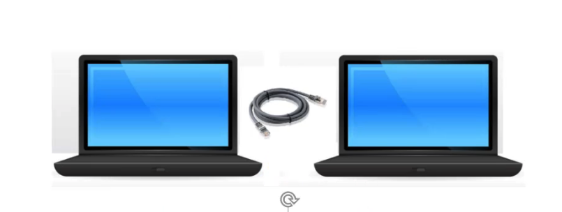
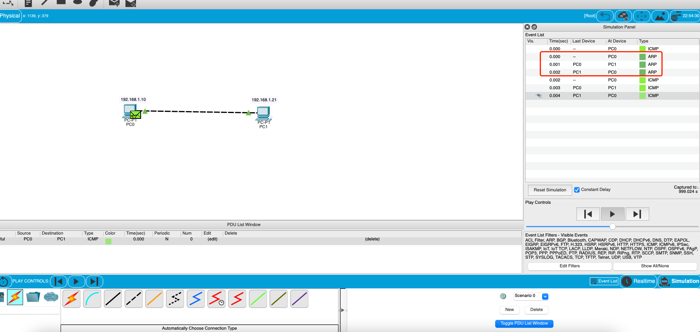
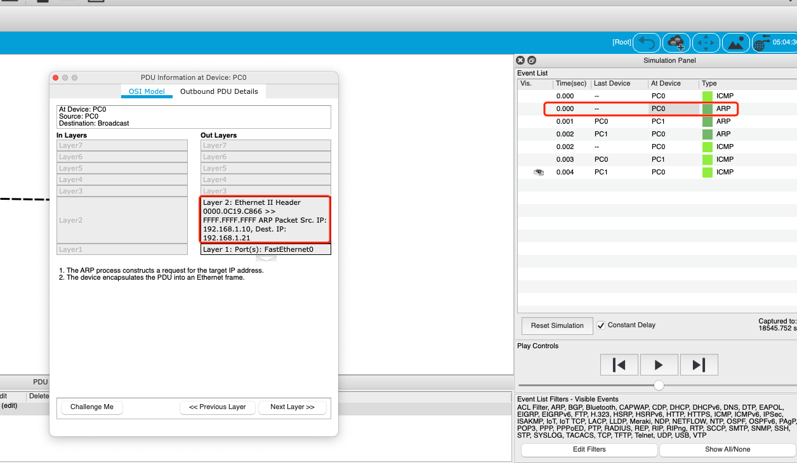
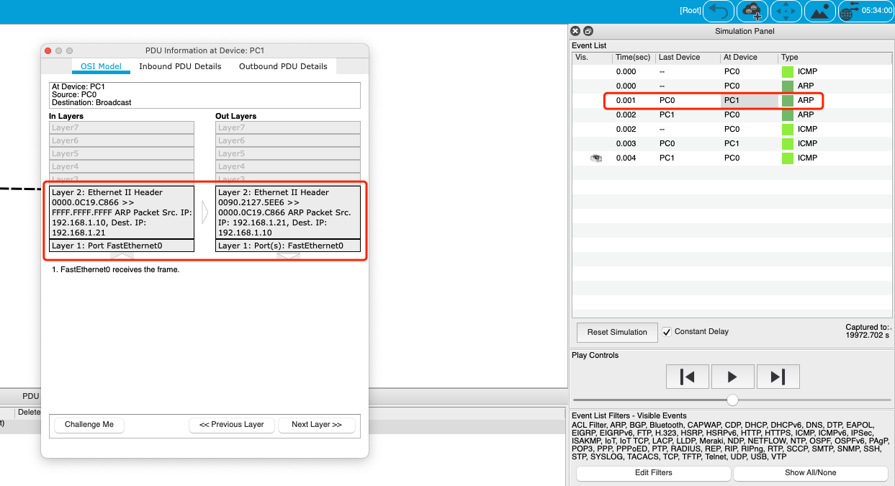
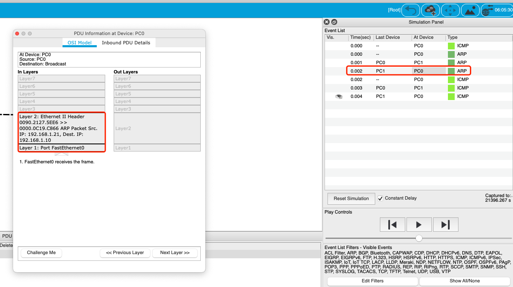
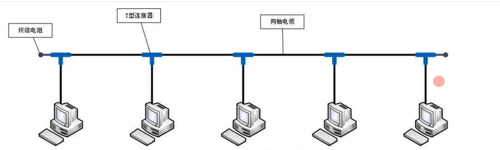
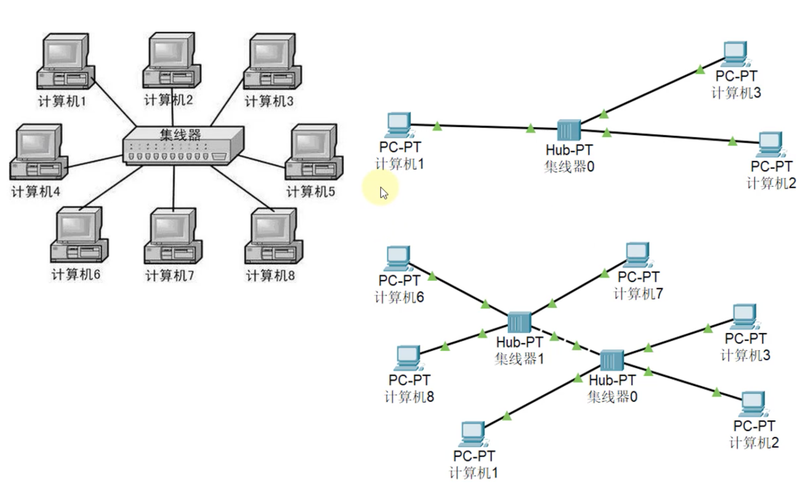
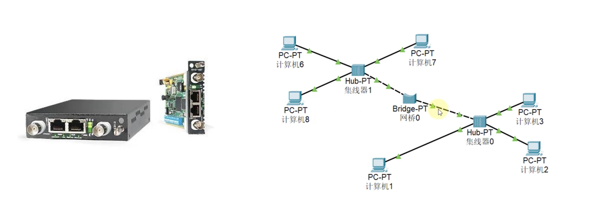
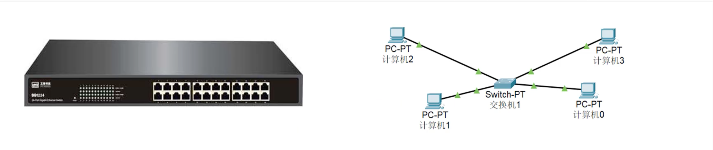
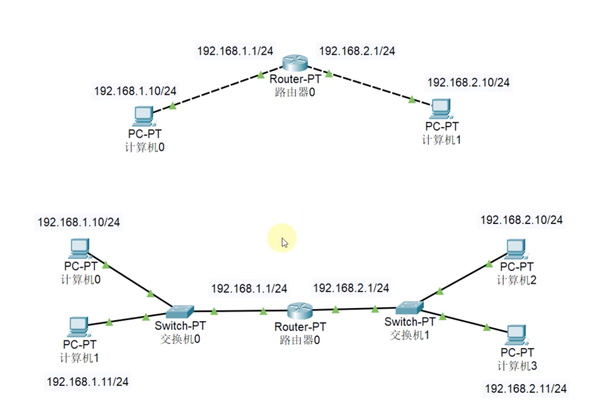

# 2. 计算机之间连接方式

## 2.1 2台PC通信 -- 铜交叉线

2个计算机之间直连: 交叉线(非直通线)。

### `ping ip` 过程分析

* 1.`192.1.168.10` 通过 ARP协议，获取到 `192.168.1.21` 的MAC地址

* 2.通过 IP+MAC地址，`192.1.168.10` 通过 ICMP`协议发包到 `192.168.1.21`

* 3.`192.168.1.21`收到后，通过 ICMP协议返回结果到 `192.1.168.10`

## 2.2 `ARP`协议获取MAC地址流程

* 主机A的IP地址为`192.168.1.11`，MAC地址为 0090.2127.5EE6
* 主机B的IP地址为`192.168.1.21`，MAC地址为 0000.0C19.C866

当主机A要与主机B通信时，地址解析协议可以将主机B的IP地址（192.168.1.21）解析成主机B的MAC地址，以下为工作流程：
* 第1步：根据主机A上的路由表内容，IP确定用于访问主机B的转发IP地址是192.168.1.21。 然后A主机在自己的本地ARP缓存中检查主机B的匹配MAC地址。

* 第2步：如果主机A在ARP缓存中没有找到映射，它将询问192.168.1.21的硬件地址，从而将ARP请求帧广播到本地网络上的所有主机。源主机A的IP地址和MAC地址都包括在ARP请求中。
> 本地网络上的每台主机都接收到ARP请求并且检查是否与自己的IP地址匹配。如果主机发现请求的IP地址与自己的IP地址不匹配，它将丢弃ARP请求。 
>
> 目的MAC为`FFFF.FFFF.FFFF`的请求是广播请求。

* 第3步：主机B确定ARP请求中的IP地址与自己的IP地址匹配，则将主机A的IP地址和MAC地址映射添加到本地ARP缓存中。

* 第4步：主机B将包含其MAC地址的ARP回复消息直接发送回主机A。 

* 第5步：当主机A收到从主机B发来的ARP回复消息时，会用主机B的IP和MAC地址映射更新ARP缓存。
  
> `注意`: 本机缓存是有生存期的，生存期结束后，将再次重复上面的过程。
  

主机B的MAC地址一旦确定，主机A就能向主机B发送IP通信了。

## 2.3 N台PC通信 -- 同轴电缆

### 通信方式: 半双工通信

半双工通信: 同1时间，只允许1个方向进行发送数据。

### 缺点
* 容易冲突
* 不安全
* 中间断了，整个瘫了

## 2.4 N台PC通信 -- 集线器(Hub)

* 集线器连接PC: 直通线
* 集线器之间连接: 交叉线

### 通信方式: 半双工通信

### 缺点
* 容易冲突
* 不安全
* 集线器是没有智商的，每次收到包后，会广播发送

### 优点
1个电脑断了连接，不会全部瘫痪

## 2.5 N台PC通信 -- 网桥(Bridge)

### 优点

* 能够通过自学习得知每个接口那侧的MAC地址
* 隔绝冲突域，可以同时通信

## 2.6 N台PC通信 -- 交换机(Switch)

### 优点
* 相当于接口更多的网桥
* 全双工通信
* 比集线器安全

> 交换机是局域网的最终方案，如果跨网段需要用到路由器。

**思考: 全球所有设备都用交换机连接会是什么情况？**

> 答: 通信之前会广播，可能到处都在广播，会浪费。

## 2.7 N台PC通信 -- 路由器(Router)

### 网线直连、同轴电缆、网桥、交换机
* 连接的设备必须在同一网段
* 连接的设备处在同一广播域

### 路由器
* 可以在不同网段之间转发数据
* 隔绝广播域

